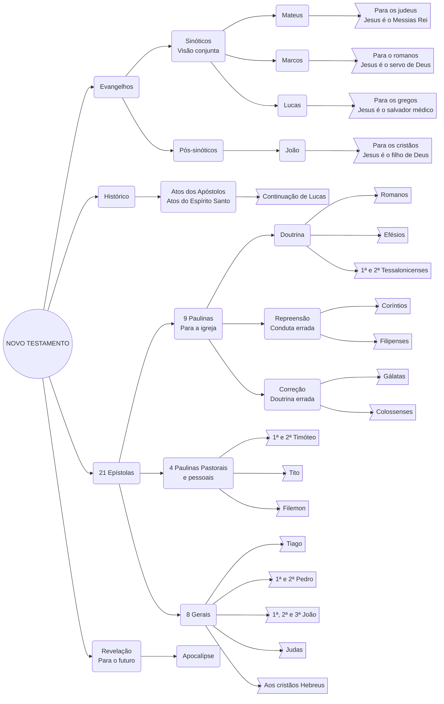

**O Novo Testamento complementa todas a promessas do Velho Testamento e estabelece uma nova aliança através do novo mediador Jesus Cristo**

## Diagrama do Novo Testamento

## Panorama do Novo Testamento

---------|----------|---------|---------
3 Evangelhos Sinóticos | (Visão conjunta) | Mateus | Para os judeus   Jesus é o Messias rei
           |  |  Marcos | Para os romanos Jesus é o servo de Deus
           |          | Lucas | Para os gregos Jesus é o salvador médico
Evangelho | (Pós-sinóticos) | João | Para os cristãos Jesus é o filho de Deus
21 Epístolas | 9 Paulinas     | Doutrina | Romanos
          | (Para a igreja)  | Repreensão (Conduta errada) | 1ª e 2ª Coríntios
          |                | Correção (Doutrina errada) | Gálatas        
          |                | Doutrina | Efésios
          |                | Repreensão | Filipenses
          |                | Correção | Colossences
          |                | Doutrina | 1ª e 2ª Tessalonissences
          | 4 Paulinas     | | 1ª e 2ª Timóteo
          | (Pastorais e pessoais)| | Tito 
          |                |           | Filemon
          | 8 Gerais       | | Tiago
          |                | | 1ª e 2ª Pedro
          |                | | 1ª, 2ª e 3ª João
          |                | | Judas 
          |                | | Aos cristãos Hebreus
 Revelação| (para o futuro)| | Apocalipse

## Referências

* CABRAL, Alana. **Evangelhos**. Seminário de Teologia das Assembléias de Deus do Ceará - STADEC.
* **Epístolas Paulinas**. Seminário de Teologia das Assembléias de Deus do Ceará - STADEC. Fortaleza, Ceará.
* **Epístolas Gerais**. Seminário de Teologia das Assembléias de Deus do Ceará - STADEC. Fortaleza, Ceará.
* **Introdução ao Novo Testamento, o desvendar da Nova Aliança**. Faculdade de Teologia do Ceará - FATECE, Fortaleza, Ceará, 2000. 