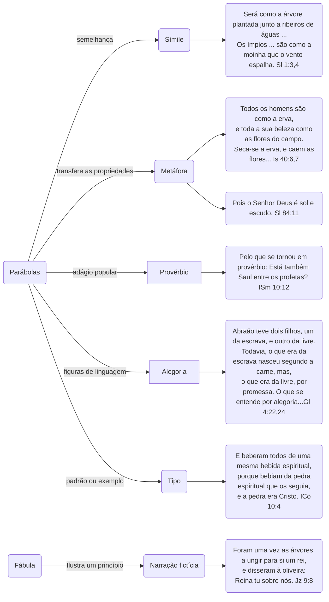

**Na parábola, a imagem do mundo visível é emprestada e se faz acompanhar de uma verdade do mundo invisível ou espiritual. As parábolas são os Portadores, os canais da doutrina e da verdade espiritual.**

# Diagrama dos tipos de parábolas

## Referência

LOCKYER Herbert. **Todas as PARÁBOLAS da Bíblia** - Uma análise detalhada de todas as parábolas das Escrituras. Ed. Vida, São Paulo, 2006.