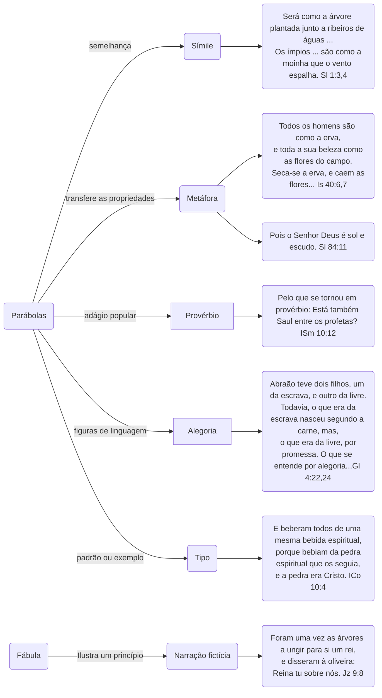

Em que diferencia a parábola da alegoria, da fábula, do provérbio e do mito?

A parábola é uma analogia, ou seja uma comparação usando algo conhecido e comum pelo ouvinte, para explicar outra coisa de forma mais simples. Quando, por exemplo, usamos uma palavra sinônima para explicar uma palavra desconhecida pelo ouvinte - o símile, ou fatos do dia a dia para demonstrar um acontecimento, ou um evento conhecido para alertar sobre algum perigo - o provérbio.

A bíblia é rica em parábolas demonstrando uma sabedoria didática para saber como lidar com as situações desafiadoras da vida.

Vejamos os variados tipos de parábolas:

## O enigma

O enigma é uma declaração que desafia a sabedoria do ouvinte para demonstrar uma grande lição.

    O SENHOR enviou Natã a Davi. Chegando Natã a Davi, disse-lhe: Havia numa cidade dois homens, um rico e outro pobre.  (2Sm 12:1)
    Filho do homem, propõe um enigma e usa de uma parábola para com a casa de Israel;  (Eze 17:2)
    Inclinarei os ouvidos a uma parábola, decifrarei o meu enigma ao som da harpa.  (Slm 49:4)
    Abrirei os lábios em parábolas e publicarei enigmas dos tempos antigos.  (Slm 78:2)
    Todas estas coisas disse Jesus às multidões por parábolas e sem parábolas nada lhes dizia; para que se cumprisse o que foi dito por intermédio do profeta: Abrirei em parábolas a minha boca; publicarei coisas ocultas desde a criação do mundo. (Mat 13:34-35)

## A metáfora

A metáfora se utiliza de algo conhecido por nós, onde na nossa experiência faz sentido, e conhecemos suas propriedades especiais, transferindo a outro objeto essas características conhecidas, de modo que o anterior nos dá uma ideia mais completa e realista das propriedades que o outro deve ter.

    Outra parábola lhes propôs, dizendo: O reino dos céus é semelhante a um homem que semeou boa semente no seu campo;  (Mat 13:24)
    Outra parábola lhes propôs, dizendo: O reino dos céus é semelhante a um grão de mostarda, que um homem tomou e plantou no seu campo;  (Mat 13:31)

## O símile

O símile usa uma comparação entre duas coisas similares, e  difere da metáfora por ser apenas um estado de semelhança, enquanto a metáfora transfere a representação de características.

No símile, a mente apenas repousa nos pontos de concordância e nas experiências que se combinam, sempre alimentadas pela descoberta de semelhanças entre coisas que diferem entre si.

O dr. A. T Pierson observa que "a parábola autêntica é, no uso das Escrituras, um símile, geralmente posto em forma de narrativa ou usado em conexão com algum episódio". Portanto, parábolas e símiles se parecem.

## O provérbio

Ainda que os princípios da parábola estejam presentes em alguns dos pequenos provérbios, das declarações proféticas enigmáticas e das máximas enigmáticas da Bíblia, no entanto, diferem do provérbio propriamente dito, que é em geral breve, trata de assuntos menos sublimes e não se preocupa em contar histórias. Os apócrifos reúnem parábolas e provérbios num só grupo: "Os países maravilhar-se-ão diante de seus provérbios e parábolas"; "Ele buscará os segredos das sentenças importantes e estará familiarizado com parábolas enigmáticas".

Embora parábola e provérbio sejam termos permutáveis no NT, Trench ressalta "que os chamados provérbios do evangelho de João tendem a ter muito mais afinidade com a parábola do que com o provérbio, e são de fato alegorias. Dessa forma, quando Cristo demonstra que o relacionamento dele com o seu povo se assemelha ao pastor com as ovelhas, tal demonstração é denominada provérbio, embora os nossos tradutores, mais fiéis ao sentido que o autor pretendia, a tenham traduzido por parábola. Não é difícil explicar essa troca de palavras.

Em parte deve-se a um termo que no hebraico significa ao mesmo tempo parábola e provérbio". De modo geral, provérbio é um dito sábio, uma expressão batida, um adágio.

## A alegoria

Não é fácil distinguir entre parábola e alegoria. Esta última não é uma metáfora ampliada e dela difere por não comportar a transferência de qualidades e de propriedades. Tanto as parábolas como as metáforas abrangem expressões e frases, servindo para desvendar e explicar algumas verdades ocultas que não poderiam ser facilmente compreendidas sem essa roupagem.

Num verbete de Fairbairn [^5] sobre as "parábolas", em sua renomada Biblical enciclopédia , ele diz:
> "A alegoria corresponde rigorosamente ao que se encontra na origem da palavra".

Considerada dessa forma, a alegoria, em sentido mais amplo, pode ser tida como um gênero, do qual a fábula, a parábola e o que geralmente chamamos alegorias são espécies".

A. alegoria, explica o dr. Graham Scroggie:[^2]
> "... é uma declaração de fatos supostos que aceita interpretação literal, mas ainda assim exige ou admite uma interpretação moral ou figurada".

A alegoria difere da parábola por conter menos mistérios e coisas ocultas.

A alegoria se interpreta por si só e nela "a pessoa ou objeto, ilustrado por algum objeto natural, é imediatamente identificado com esse objeto".

Diz o dr. Salmond:[^3]
> "Quando nosso Senhor conta a grande alegoria da vinha, do agricultor e dos ramos, em que ensina aos seus discípulos a verdade sobre o relacionamento que ele próprio tinha com Deus, começa dizendo que ele próprio é a videira verdadeira e seu Pai, o agricultor".

Bullinger [^1] lembra que há grande controvérsia sobre a definição e significado exato de alegoria e declara que, na verdade, os símiles, as metáforas e as alegorias são todos baseados na comparação:

* Símile é a comparação por semelhança.
* Metáfora é a comparação por correspondência.
* Alegoria é a comparação por implicação.

Na terceira, é subentendida. A alegoria é então diferente da parábola, pois esta é um símile continuado, enquanto aquela representa algo ou dá a entender que alguma coisa é outra.

Há uma alegoria a que Paulo, em Gálatas 4 [^6], se refere de modo inequívoco:
> "...O que se entende por alegoria..." .

A alegoria é sempre apresentada no passado e nunca no futuro.

A alegoria oferece outro ensinamento com base nos acontecimentos do passado, enquanto a profecia trata de acontecimentos futuros e corresponde exatamente ao que se diz.

Hillyer Straton, em seu A guide to the parables of Jesus [^4], comenta que:
> "A alegoria é uma descrição codificada. Ela personifica coisas abstratas; não põe uma coisa ao lado da outra, mas faz a substituição de uma pela outra. Cada aspecto da alegoria se torna importante".

O dr. Straton, então, acaba por citar a mais famosa alegoria de toda a literatura: O peregrino.

## A fábula

* A fábula é uma narração fictícia que pretende ilustrar um princípio ou uma verdade .
* A missão primordial da fábula é reforçar o conceito da prudência.
* A fábula, usada poucas vezes nas Escrituras, está a quilômetros de distância da parábola, embora uma possa, em alguns momentos, ser semelhante à outra nos aspectos externos.
* Comparando qualquer das fábulas com as parábolas de Jesus, percebe-se que a fábula é um tipo inferior de linguagem figurada e trata de assuntos menos elevados.
* Está associada à terra e focaliza a vida e os negócios comuns a todos.
* Tem por função transmitir lições de sabedoria prudente e prática e gravar nas mentes dos ouvintes as virtudes da:
  * prudência,
  * da diligência,
  * da paciência e
  * do autocontrole.

Também trata do mal como loucura e não como pecado, além de ridicularizar as falhas e desdenhar os vícios, escarnecendo deles ou os temendo. Essa é a razão por que a fábula faz grande uso da imaginação, dotando plantas e animais de faculdades humanas, fazendo-os raciocinar e falar. A parábola, no entanto, age numa esfera mais sublime e espiritual e nunca se permite a zombaria ou a sátira. Tratando das verdades de Deus, a parábola é naturalmente sublime, com ilustrações que correspondem à realidade nunca monstruosas ou antinaturais.

Na parábola, nada existe contra a verdade da natureza. Fairbairn diz:
> "A parábola tem um objetivo mais admirável. A parábola poderia tomar o lugar da fábula, mas não o contrário".

## O tipo

* Significa marca ou impressão e tem a força da cópia ou do padrão.
* As parábolas unem os tipos de um lado, e os milagres de outro.
* Todas as figuras de linguagem que a Bíblia emprega são elos de uma corrente unida de forma inseparável; os elos como um todo só podem ser desvinculados em detrimento de alguns.

Os muitos tipos da Bíblia constituem um estudo independente e fascinante, chamado tipologia, e assim como as metáforas, são palavras que podem ter seu simbolismo descrevendo categorias de significados e características de forma ímpar.

Por exemplo: na irônica referência de Ezequiel ao rei de Tiro como "querubim da guarda ungido", Itobal, que se considerava um semideus, expandiu suas ambições além dos interesses de Tiro e tornou-se "um tipo" das pretensões do Anticristo vindouro, que se empenhará por imitar a Deus (Dn 7:25; 11:36,37; 2Ts 2:4; Ap 13:6). É muito provável ainda que, na "elevação de sua visão inspirada, o profeta enxergasse, por trás deste rei, a terrível figura de Sata-nás, de quem Itobal era instrumento e que possuirá e inspirará o Anticristo.

Portanto na tipologia de figuras e símbolos da bíblia, são demonstradas as coisas celestiais através das coisas terrenas. Assim os tipos sempre apontam para o seu anti-tipo correspondente, conforme vemos na tipologia seguinte: [^7]

|                      Tipo | = Anti-tipo                   |
| ------------------------: | ----------------------------- |
|         Adão homem carnal | = Cristo homem celestial      |
|    Elias no carro de fogo | = o arrebatamento da igreja   |
| O sacerdote Melquisedeque | = Cristo o sumo sacerdote     |
|          Davi rei de Judá | = Cristo o rei dos reis       |
|         O maná no deserto | = o alimento espiritual       |
|     A libertação do Egito | = a libertação do mundo       |
|       A marcha no deserto | = nossa peregrinação na terra |

## Conclusão

Fairbairn resume a parábola da seguinte maneira:

> "Diferente do símile e da metáfora e considerada uma espécie de alegoria, pode-se dizer que a parábola é uma narrativa, ora verdadeira, ora com aparência da verdade; exibe na esfera da vida natural um processo correspondente ao que existe no mundo ideal e espiritual".

## Diagrama de tipos de parábolas

## Referências

Texto adaptado de:

LOCKYER Herbert. [**Todas as PARÁBOLAS da Bíblia**](https://www.slideshare.net/Dersubuuk/173811-todas-as-parbolas-da-biblia) - **Uma análise detalhada de todas as parábolas das Escrituras**. Ed. Vida, São Paulo, 2006.

[^1]: BULLINGER, E. W. **Figures of speech Used in the Bible** - Figuras de linguagem usadas na bíblia. Kindle edition, 2015.

[^2]: SCROGGIE , W. Graham. **A guide to the gospels**. Pickering and Inglis, London, 1948. **THE INTERNATIONAL standard Bible encyclopaedia**. Eerdmans, Grand Rapids, 1939.

[^3]: SALMOND , Principal. **The parables of our Lord**. T. and T. Clark, Edinburgh, 1893.

[^4]: STRATON , Hillyer H. **A guide to the parables of Jesus**. Eerdmans, Grand Rapids, 1959.

[^5]: FAIRBAIRN , Patrick. **Imperial standard Bible encyclopaedia**. Zondervan, Grand Rapids.

[^6]: CRISPIM, Cláudio. **Gálatas 4 - As alegorias das duas alianças**. Disponível em <https://estudobiblico.org/galatas-4-as-alegorias-das-duas-aliancas/>.

[^7]: EMELO, J. L. Sombras e mistérios da Bíblia. Disponível em <https://ferramentasdeteologia.com/tipologia-tipos-humanos-de-cristo/>.
